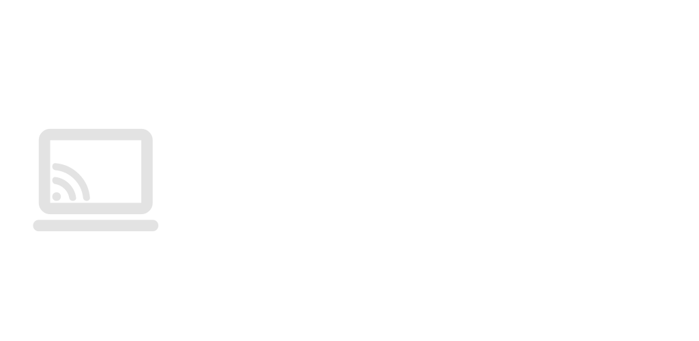

<div align="center">



# PCLink Extensions

[](https://www.gnu.org/licenses/agpl-3.0)
[](https://github.com/BYTEDz/pclink-extensions/actions/workflows/package.yml)
[](https://www.python.org/)
[](EXTENSIONS.md)

**The official repository for [PCLink](https://github.com/BYTEDz/PCLink) Manifest v2 extensions.**  
This repository houses official extensions, backend automation modules, dashboard widgets, and development templates for the PCLink ecosystem.

</div>

---

##  Documentation

**Complete technical documentation is available in the [PCLink Wiki](https://github.com/BYTEDz/PCLink/wiki)**

-  [Extension Development Guide](https://github.com/BYTEDz/PCLink/wiki/Extension-Development) - Architecture, Manifest v2, and runtime options
-  [Host Broker SDK](https://github.com/BYTEDz/PCLink/wiki/Host-Broker-SDK) - Client broker API & Material 3 styling tokens
-  [Contributing Guide](CONTRIBUTING.md) - Guidelines for package submission and verification
-  [Marketplace Architecture](https://github.com/BYTEDz/PCLink/wiki/Marketplace-Architecture) - Registry lifecycle and SHA-256 integrity checks

---

##  Quick Start

###  Installing Extensions

1. **Integrated Marketplace**: Open the PCLink Web UI or Companion App and navigate to **Extensions → Marketplace**. Select any extension for direct one-click installation.
2. **Manual Installation**: Drag and drop any `.pclink` bundle directly into the Web UI **Extensions** tab, or load it via direct URL.
3. **Release Binaries**: Download standalone `.pclink` packages from the [Releases](https://github.com/BYTEDz/pclink-extensions/releases) page.

###  Creating Extensions

Developers can build custom extensions using the provided [Starter Template](templates/starter-template/) as a baseline. Extensions support multiple execution models:

- **Broker Mode (`runtime: "none"`)**: Pure client-side JavaScript leveraging host storage, media, power, and notifications without background process overhead.
- **Python Worker (`runtime: "python"`)**: Isolated FastAPI backend subprocess with system bindings and IPC logging.
- **Node.js Worker (`runtime: "node"`)**: Supervised JavaScript server process.
- **Native Binary (`runtime: "binary"`)**: Pre-compiled platform executable (Rust, Go, C++).

---

##  Repository Structure

```text
pclink-extensions/
├── extensions/          # Official Manifest v2 extension packages
├── scripts/             # Registry compiler, SHA-256 calculator & CI linter
│   ├── generate_registry.py
│   └── lint_extensions.py
├── templates/           # Starter template for developers
│   └── starter-template/
├── EXTENSIONS.md        # Human-readable catalog
└── extensions.json      # Machine-readable lean marketplace registry
```

---

##  Repository Standards

Extensions submitted to this repository must adhere to the following specifications:

- **Manifest Specification**: Every extension must include a valid `manifest.json` conforming to Manifest v2 (`manifest_version: 2`).
- **Target Compatibility**: Manifests must declare `min_server_version: "4.8.0"` and `pclink_version: ">=4.9.0"`.
- **Package Format**: Extensions are bundled as `.pclink` archives containing `manifest.json` at the root directory level.
- **Security Compliance**: Privileged capabilities (`system.exec`, `fs.write`, `input.inject`, `power.control`) must be explicitly specified under `permissions` and `declared_permissions`.
- **Static Verification**: All contributions must pass `python scripts/lint_extensions.py` before pull requests are merged.

---

##  Maintainers

<table>
  <tr>
    <td align="center">
      <a href="https://github.com/AzharZouhir">
        
        <br />
        <sub><b>Azhar Zouhir</b></sub>
      </a>
      <br />
      <sub>Creator & Lead Developer</sub>
      <br />
      <a href="mailto:support@bytedz.com"></a>
      <a href="https://github.com/AzharZouhir"></a>
    </td>
  </tr>
</table>

---

<div align="center">

Free Palestine • Developed in Algeria

</div>